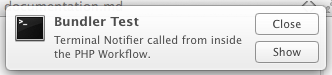
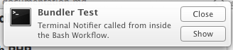

# Alfred Bundler


> [View on Github](https://github.com/shawnrice/alfred-bundler/tree/aries)

## What is it?

The Alfred Bundler is a dependency bundler designed to work with [Alfred 2](http://www.alfredapp.com) [workflows](http://www.packal.org); well, it's actually the opposite of a bundler in that it lets a workflow author declare dependencies and load assets without needing to bundle them with the workflow. Consider it a poorly named framework.

> Within the context of the bundler, everything is considered an "asset" and will be referred to as such from here on.

## Why do I need it?

The bundler addresses five main problems.

 1. __Limited Dropbox space__. Alfred allows you to sync your workflows via Dropbox. Duplicated utilities and libraries can eventually add up in space (for those of us who install far too many workflows). The bundler makes it so that each computer has one copy of a library or utility that lives in Alfred's Data directory.
 2. __Github filesize limitations__. Github limits us to 10mb for a file with an `.alfredworkflow` extension. Many of us use Github to distribute our workflows, and [Packal](http://www.packal.org), the workflow and theme repository, uses Github as a backend for the workflows, so if a workflow reaches that 10mb mark, then it's no longer available to download.
 3. __Gatekeeper__. You know gatekeeper right? It's that thing that Apple introduced in 10.7 that makes it harder to open apps if they aren't signed and near impossible in 10.9 if they don't come from the App Store (the default setting). If your workflow requries the use of a utility that isn't signed and doesn't come from the app store, then your workflow breaks. The bundler checks to see if Gatekeeper is active; if it is then and the utility is not whitelisted, then it will transparently ask the user to authorize it.
 4. __Avoid dependency clashes__. One workflow wants one version. Another workflow needs another version. The bundler lets these live side by side make sure that the workflows do not clash.
 5. __Follow best practices__. It has been generally agreed on within the workflow community that a workflow should not install anything outside of the data directory. The bundler ensures that everything is where it should be without having to deal with messy installation parts yourself.

Basically, the bundler simplifies your life by helping your workflow just work, keeps the data organized, and is just pretty cool.

## How does it work?

### The short:

A workflow needs to include a "wrapper" script that will interface with the bundler; the wrapper makes requests to the bundler interfaces, which return the paths to the needed assets. But there is magic that is twofold: first, if the wrapper can't find the bundler, then the wrapper installs it; and, second, if the bundler can't find an asset, then it installs it.

### The medium:

A workflow author includes a file that has two functions:

 1. ``__load()`` (in whichever syntax the language uses), and
 2. ``__installBundler()``

> The functions and global variables are named so as not to clash with the workflow itself.

The only function that the author needs to use is the __load() function, which responds differently based on the language of the wrapper and the 'type' of asset.

For instance, when PHP loads a library, you just need to `require_once('file.php');` the file, so the bundler automatically does that for you so you just have to tell it just which library to load, and it's done, even if the library has multiple files.

For Bash libraries, it just returns the path, which is actually the way that most of the bundler works: it just returns the path. For instance, to invoke Terminal Notifier, you need to use the path that includes `Terminal-Notifer.app/Contents/MacOS/terminal-notifer`. Pashua's scripts just want to path where Pashua.app is stored. So, you get the necessary information, making everything easier to invoke. More details instructions below.

When an asset is requested, the wrapper tries to call the bundler, and, if the bundler isn't installed, then it installs it and continues by
 1. looking to see if it is already there, and, if so, returns the asset information; if not, it
 2. looks to see if a json file is included with the call, and, if so, then it downloads the asset and returns the asset information; if not, it
 3. looks into the "meta/defaults" folder for a matching asset, and, if it's there, it downloads it and returns the information.
 4. If it gets here, it fails and attempts to tell the user that the workflow implemented the bundler erronerously.

The bundler itself as well as all of the assets are installed in Alfred's Workflow Data folder ("``~/Library/Application Support/Alfred 2/Workflow Data/``") in alfred-bundler-MAJOR_VERSION, so the current directory is alfred-bundler-aries.

### The long:

Read the damn code.

## Versioning

The bundler is versioned with major / minor releases. The wrapper will always be compatible with the current major version. Hence, major versions will be released only when there is a necessary change in the way that the front-end needs to interact with the backend.

To avoid dependency clashes, each major bundler will keep itself and its assets separate from others. The current major version is **Aries**.

The bundler will automatically install minor updates to itself, including updating the wrapper.

## What sort of assets are supported?

Currently, the bundler natively supports PHP and Bash libraries as well as "utilities" or helper applications such as Terminal-Notifier and CocoaDialog. The metadata of an asset is defined in a JSON file, and there are certain defaults that come with the bundler.

### Default Assets

The following assets are currently "included" with the bundler.

**PHP**

 1. [Workflows.php](http://dferg.us/workflows-class/) (v0.3.3)
 * [CFPropertyList](https://github.com/rodneyrehm/CFPropertyList) (v2.0)

**Bash**

 1. [BashWorkflowHandler](https://github.com/markokaestner/bash-workflow-handler)

**Utilities**

 1. [SetupIconsForTheme](https://github.com/clintxs/alfred-icons)
 * [GlyphManager](https://github.com/Ritashugisha/GlyphManager)
 * [Terminal-Notifier](https://github.com/alloy/terminal-notifier) (v1.5.0)
 * [CocoaDialog](http://mstratman.github.io/cocoadialog/)
    * v3.0.0-beta7
    * v2.1.1
 * [Pashua](http://www.bluem.net/en/mac/pashua/)
 * PHP5.5.5-CLI
 * Viewer (an automator application that shows a pop-up HUD)

_If there is a utility that you think should be included as a default, then submit a pull request on Github_


### How do I use the bundler?

At minimum, you just need to include one of the wrappers in your workflow directory (either in the root or in a subfolder), and then load the assets with the appropriate ``__load`` function.

#### Download the wrappers:

 * [PHP](https://raw.githubusercontent.com/shawnrice/alfred-bundler/aries/wrappers/alfred.bundler.php)
 * [Bash](https://raw.githubusercontent.com/shawnrice/alfred-bundler/aries/wrappers/alfred.bundler.sh)
 * Other (Use for any other language)

#### Using the __load() function

Again, all you will need to invoke the bundler is to call a single ``__load`` function, which can take up to four arguments.
 1. Asset Name (required)
  : The name of the asset called. This name needs to match an asset defined in a JSON file and is case sensitive.
 2. Asset Version (optional)
  : The version of the asset; defaults to "default"
 3. Type (optional)
  : The type of the asset being called, either language or utility. If a language, then it will be the name of the language lowercase: php, bash.
 4. JSON file path (optional)
  : A filepath to a custom JSON file that defines the asset. If you are using one of the default assets, then this is not needed.

For the PHP wrapper calling a PHP library, you will need only the name, and the same goes for the Bash wrapper calling a Bash library. However,
if you want to call anything else, then you will need the first three arguments: Name, Version, and Type. If you want to use a non-default asset,
then you must include a filepath to a JSON file that has the appropriate schema. See examples for ``__load`` and the schema below.

#### Loading PHP library with PHP

The following code loads the "default" version of David Ferguson's Workflows.php library (v0.3.3).

````
require_once('alfred.bundler.php');
__load( 'Workflows' );
````

You could also call it with a longer syntax.

````
require_once('alfred.bundler.php');
__load('Workflows', '3.3', 'php');
````

#### Loading a utility with PHP


````
require_once('alfred.bundler.php');

$tn = __load('terminal-notifier' , 'default' , 'utility' );

// Execute it
exec( "$tn -title 'Bundler Test' -message 'Terminal Notifier called from inside the PHP Workflow.'" );
````



#### Loading a Bash library with Bash

````
. alfred.bundler.sh

BashWorkflowHandler=`__load BashWorkflowHandler`
. "$BashWorkflowHandler"
````

#### Loading a utility with Bash

````
tn=`__load Terminal-Notifier default utility`
"$tn" -title 'Bundler Test' -message 'Terminal Notifier called from inside the Bash Workflow.'
````



#### Loading something from another language

The bundler currently natively supports only PHP and Bash. It will be expanded for more languages in the future, but library dependencies in Python and Ruby especially call for an entirely different implementation logic.
However, a bash script is included that other languages can use.

#### Using the bundler without including the file

This is fun, but it ensures the latest copy of the wrapper.

````
if ( ! file_exists('alfred.bundler.php') )
  exec( 'curl -sL "https://raw.githubusercontent.com/shawnrice/alfred-bundler/aries/wrappers/alfred.bundler.php" > "alfred.bundler.php"' );
````
## Custom Assets

What is great about the bundler is that you are not limited to the assets that come with it. If you would like to use another library or utility, then create a simple JSON file, drop it into your workflow folder, and note it in the call to the function to load the asset. The bundler will do the rest.

Here is a sample JSON file:

````
{
"name":"ASSET-NAME",     # Do not duplicate an asset name. Check the "meta/defaults"
                         # folder so as not to duplicate.
"type":"LANGUAGE|utility", # Currently, only php and utility are fully supported.
"versions":{
  "default":{            # Versions are keys here but also the first value.
    "get-method":"zip",  # methods: direct, zip, tar.gz, tgz
    "invoke": "...",     # this is how the workflow invokes it. Often, it's just a path.
    "files":{
     "1":"URL"           # Each separate file to download needs a URL; use a new key
                         # for each file.
    },
    "install":{          # Install instructions. For version "aries" it will be just a
                         # list of shell commands. You can use the flags:
                         # __DATA__ for the bundler data directory
                         # __CACHE__ for the bundler cache directory, and
                         # __FILE__ for any particular needed.
                         # with "cp" always use "-f"; and if it is a .app or a folder,
                         # then use "-fR"; don't use mv.
                         # Write the steps here numbered 1-n... as keys.
     "1":"cp -f '__CACHE__/SOME FILE' '__DATA__'"
    }
  },
  "1.5.0":{              # a numbered version. Bascially everything below is the same.
    "get-method":"zip",
    "invoke": "terminal-notifier.app/Contents/MacOS/terminal-notifier",
    "files":{
     "1":"https://github.com/shawnrice/Alfred-Helpers/blob/master/terminal-notifier.app.zip?raw=true"
    },
    "install":{
     "1":"cp -fR '__CACHE__/terminal-notifier.app' '__DATA__'"
    }
  }
 }
}
````

For more examples, just look at the JSON files in the meta/defaults folder in the bundler.


Then, alter the function call. For a PHP library in PHP:
````
__load( 'myAsset' , 'default' , 'php' , 'path/to/myAsset.json' );
````

For a utility in PHP:

````
$myAsset = __load( 'myAsset' , 'default' , 'utility' , 'path/to/myAsset.json' );
````

If it is a PHP library, then it will automatically include all the files. If it is a utility, then it will return the path to the utility.

## Uninstalling

Each time an asset is called, the bundler "registers" that asset to the workflow that called it. Hence, it has a good idea of what assets have been orphaned. A companion workflow will be released to let you browse these assets as well as to let you uninstall these orphaned assets.

## How do I implement these assets?

Find the documentation on the individual asset. The bundler just gives you an easy way to install them.

## TODO

* Better error handling for silent fails.
* Better tests for when user isn't connected to the internet.
* Applescript wrapper.
* Ruby, Python (far future).

License
---
GPLv3